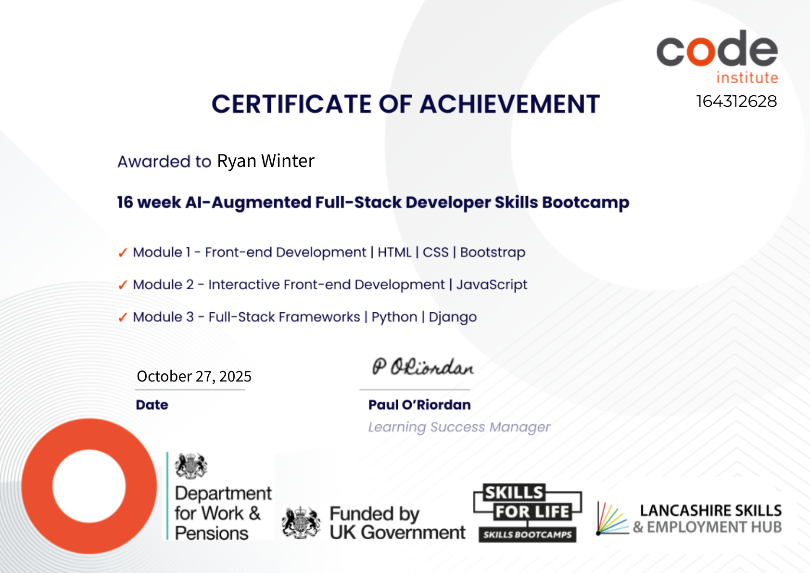
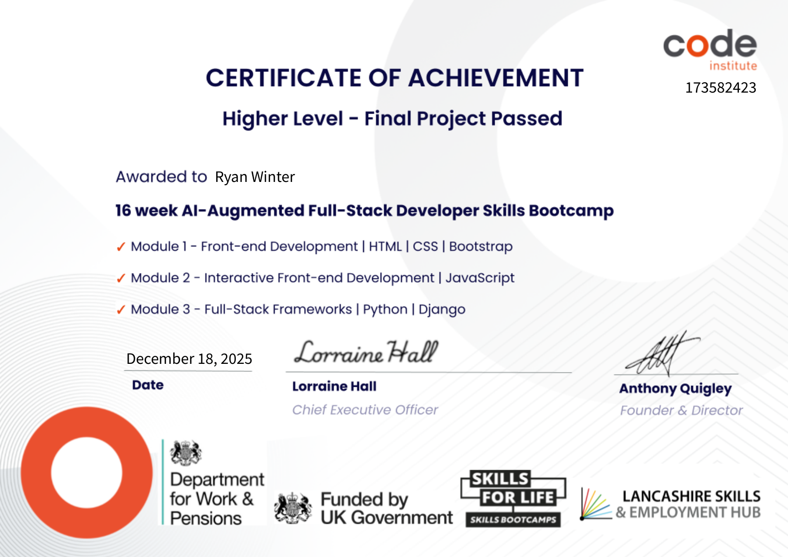

# Hi — I'm zZWinterZz 👋

## I'm a developing web/software engineer
My first steps into the field were a web development course run by Code Institute, which gave me the fundamentals demonstrated by the course walkthrough projects below. Since then I've been pushing myself to understand the full process of building software — from an initial idea through to a live, working product — not just writing isolated code. Part of that is deliberately leaning on AI tools to increase productivity and sharpen testing and debugging, while making sure I actually understand what's happening underneath.

https://zzwinterzz.github.io/zZWinterZz/

🔧 Tech highlights

- HTML, CSS, JavaScript, Python — used throughout the course walkthroughs (love-running, boardwalk-games, seven-seas-spa) and full‑stack projects  
- Java — used to build the gooey-red Minecraft mod (NeoForge)  
- Django for backend / full‑stack work — the-dead-web (capstone) and ClearCandidate  
- React (with Next.js) — ClearCandidate web frontend  
- Vanilla JS for interactive frontends and small games — think-you, typeracer, love-maths

⭐ Notable projects

### First real-world project
- **alansalbums.com** — First real-world e‑commerce practice project (private repo) built for a relative to sell vintage media (vinyl records and cassette tapes). Drew heavy inspiration from the const-collection hackathon and focuses on product presentation, inventory, and checkout UX.  
  Live: https://www.alansalbums.com

### Live & in‑progress projects
- **ClearCandidate** — Full‑stack blind talent marketplace that replaces commission-based recruitment with anonymous candidate profiles and flat‑fee pricing; candidate identity is revealed ("Cleared") only once both employer and candidate agree. Django REST Framework + PostgreSQL + Stripe backend, Next.js/React + Tailwind frontend, containerized with Docker. This was my project to move beyond vanilla JS into more mainstream stack variants (React/Next.js) while building a real, working, marketable product rather than a practice exercise. Built working closely with AI tooling (Claude) across schema design, API structure, and deployment.  
  Live: https://www.clearcandidate.co.uk/

- **gooey-red** — A Minecraft mod (Java, NeoForge) adding a wireless redstone‑alternative logic system (timers, logic gates, sequencers, routers linked by named channels instead of physical wiring). Originally built as a project for my kids to play with, it became a serious engineering exercise: as a stress‑test of the mod's own capabilities, I built a fully working 8‑bit stored‑program computer (ALU, registers, ROM/RAM, a 32×32 display, and a real instruction set) entirely out of the mod's own in‑game components. Published for community testing on CurseForge. Built working closely with AI tooling (Claude) across mod development and the CPU build.  
  Repo: https://github.com/zZWinterZz/gooey-red  
  CurseForge: https://www.curseforge.com/minecraft/mc-mods/gooeyred

### Capstone & personal work
- **the-dead-web** — Capstone zombie‑survival game (personal). Focused on database design and CRUD operations for players, inventory, and game state.  
  Repo: https://github.com/zZWinterZz/the-dead-web  
  Deployed: https://the-dead-web-fd50d169e1f7.herokuapp.com/

- **think-you** — Personal frontend project where I led design and UI decisions; explores client-side state and UX patterns.  
  Repo: https://github.com/zZWinterZz/think-you  
  Live: https://zZWinterZz.github.io/think-you/

### Course walkthroughs — guided course material

- **love-running** — HTML/CSS walkthrough teaching layout, responsive design, and accessible content.  
  Repo: https://github.com/zZWinterZz/love-running  
  Live: https://zZWinterZz.github.io/love-running/

- **boardwalk-games** — Fictional boardgame library & café walkthrough demonstrating layout, component organization, and styling for themed content pages.  
  Repo: https://github.com/zZWinterZz/boardwalk-games  
  Live: https://zZWinterZz.github.io/boardwalk-games/

- **seven-seas-spa** — Static site walkthrough/demo showing structure and styling patterns for a spa landing page.  
  Repo: https://github.com/zZWinterZz/seven-seas-spa  
  Live: https://zZWinterZz.github.io/seven-seas-spa/

### Interactive JavaScript walkthroughs
- **typeracer** — Typing game walkthrough teaching event handling, timers, scoring, and simple state management.  
  Repo: https://github.com/zZWinterZz/typeracer  
  Live: https://zZWinterZz.github.io/typeracer/

- **love-maths** — Interactive math practice walkthrough focusing on input validation, dynamic UI updates, and exercise design.  
  Repo: https://github.com/zZWinterZz/love-maths  
  Live: https://zZWinterZz.github.io/love-maths/

### Hackathons & collaborations
- **const-collection-full-stack-hackathon** — E‑commerce hackathon collaboration built for a real‑world stakeholder to showcase and sell artwork; focused on product listings, cart/checkout flows, and stakeholder UX. (repo owner: DylanAustin-TheDreamer)  
  Repo: https://github.com/DylanAustin-TheDreamer/const-collection-full-stack-hackathon  
  Deployed: https://const-collection-0f06bd9d4705.herokuapp.com/

- **http-ano** — Musical keyboard simulator focused on JavaScript interactivity and audio APIs (repo owner: etherOnGitHub). This was an interactive/hackathon-style project (not a walkthrough).  
  Repo: https://github.com/etherOnGitHub/http-ano

📘 Notes about the work

- Course material: most repos are coursework walkthroughs and guided projects created as part of the course curriculum.  
- Collaborations: hackathon repos were team efforts with other students.  
- Personal / creative control: the-dead-web (capstone) and think-you are my personal projects where I led the design and implementation choices.  
- Live & in-progress: ClearCandidate and gooey-red are ongoing projects built working closely with AI tooling (Claude) — used deliberately to move faster while I keep building up my own understanding of the underlying code.  
- Deployments: the-dead-web and const-collection have Heroku deployments; other repos are hosted via GitHub Pages.

🚀 What I'm learning / current focus

- Learning React and how to integrate it with Django, using ClearCandidate (still a work in progress) as the proving ground  
- Developing a stronger command of core fundamentals while improving how effectively I direct AI tools through clear, descriptive prompting  
- Better Django architecture and deployment practices  
- More advanced JavaScript patterns and UX for interactive apps  
- Writing tests and improving maintainability

📫 Contact

- LinkedIn: https://www.linkedin.com/in/ryan-winter-893194340

🎓 Certifications

Verified via [credential.net](https://www.credential.net/profile/ryanwinter712201/wallet) (Accredible, W3C Verifiable Credentials) — click either certificate to verify, or visit the wallet link above to download Open Badge 3.0 / W3C VC formats directly.

  
  

